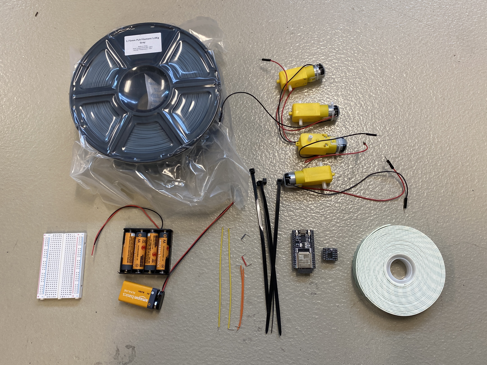
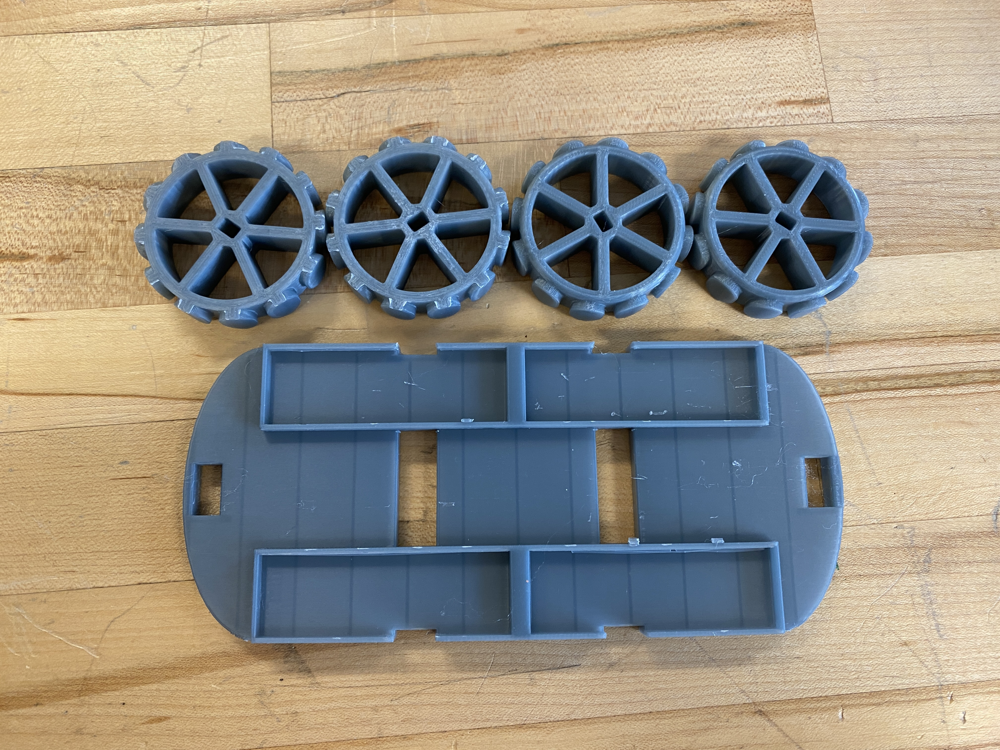
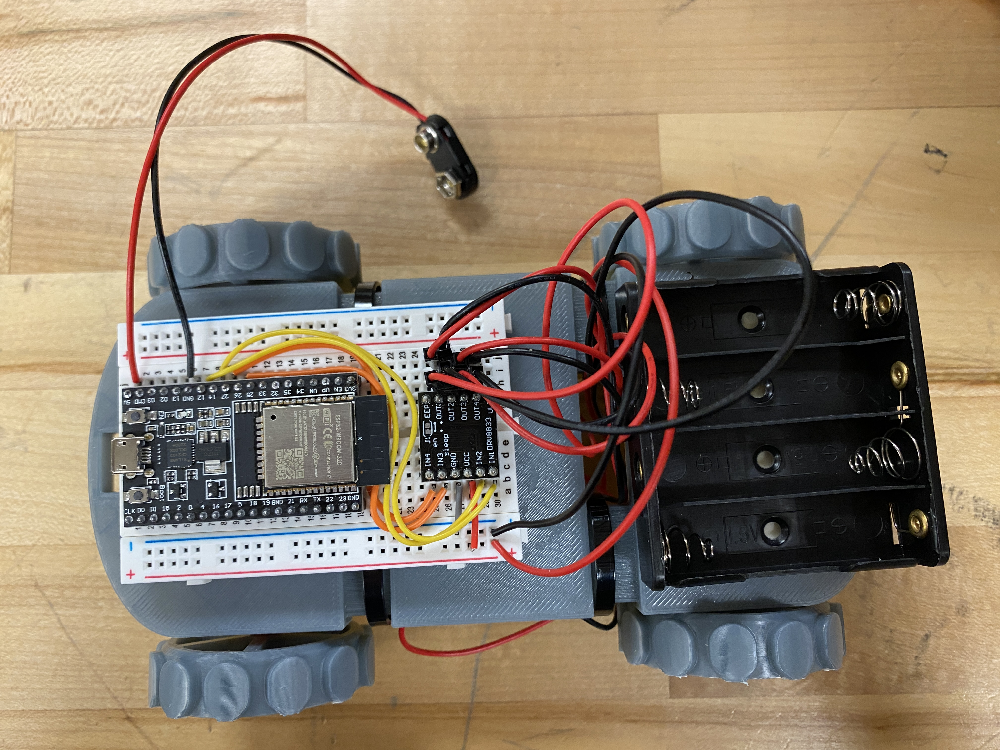

# RC-Car
This is a RC Car Workshop tutorial. To create this car, follow the below steps.

### BOM (Bill of Materials)

| Name                         | Number Units |
|------------------------------|--------------|
| PLA Filament                 | -            |
| ESP32-WROOM-32D              | 1            |
| USB Micro Data Cables        | 1            |
| Jumper Wire                  | 6            |
| TT Motor Dual DC Motor       | 4            |
| DRV8833 Motor Drive Module   | 1            |
| AA Battery                   | 4            |
| 4 AA Battery Holder          | 1            |
| 9V Battery                   | 1            |
| 9V Battery Connector         | 1            |
| Small Breadboard             | 1            |
| Zip Ties                     | 4            |
| Hot Glue or Tape             | -            |

### 1. 3D Print your parts.
3D print the chassis (CAD/chassis.stl) and 4 wheels (CAD/wheel.stl). Optionally, you can print fun ad-ons/mods (CAD/Mods/...).

### 2. Attach your motors and wheels
Use zipties to attach your motors to the bottom of your chassi. Add the wheels to the motors.

### 3.  Wire your components
Flip over the chassi, add the breadboard, and batttery holders using tape or hot glue to secure as necessary. Wire the components using the following wiring diagram.

### 4.  Upload Code to your arduino.
a. Make sure the Arduino IDE and UART Driver is installed on your computers:

    i. Arduino IDE: https://www.arduino.cc/en/software	

    ii. UART Driver: https://www.silabs.com/developers/usb-to-uart-bridge-vcp-drivers?tab=downloads		
        * On Windows, download/extract CP210x VCP Windows and run CP210xVCPInstaller_x64. 
        * On Mac, download/extract CP210x VCP Mac OSX Driver and run SiLabasUSBDriverDisk.dmg

b. In the Arduino IDE, go to Tools > Board > Board Manger. Type in ESP32 and install esp32 by Espressif. 

c. Plug in the ESP32 to your computer and click on the new port that is added in the white box in the top bar. A window with “Select Other Board and Port” should pop up. Under boards, filter and select “ESP32-WROOOM-DA Module”. Then click okay.

d. Now time to code! Copy/Paste one of the following programs into the editor and make sure save it is saved: 

    i. Program different functions to turn the motors: https://github.com/UAA-Robo/RC-Car/blob/main/rc_motor_test.ino

    ii. Program the code to be remote controlled w/ bluetooth:https://github.com/UAA-Robo/RC-Car/blob/main/rc_remote_control.ino	

e. Make sure the ESP32 is plugged into the computer and press the arrow to upload to the ESP32. The program will immediately begin.

f. If you’re running the remote control code (4b).You will also need to download the RemoteXY (https://remotexy.com/en/download/) app

    i. Open the app and click “+” > “Bluetooth LE”. Select your “myESP32” as your device (unless you change it in the code. You should then connect

### 5. Add battteries.
Double check your wiring and add batteries

Credit: Mya Schroder, Jaren Ramirez, Reese Cochran

